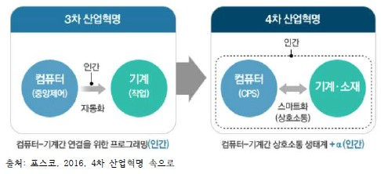

## 4차 산업혁명의 도래

> 정보사회와 4차 산업혁명
---

## 4차 산업혁명의 개념

4차 산업혁명은 2016년 다보스포럼에서 클라우스 슈밥이 처음 제시한 개념이다. 아직까지 충분한 논의가 이루어지지 않아 그 의가 명확히 정립된 것은 아니다. 
4차 산업혁명을 정의하기만 쉽지않지만, 최근 의 논의를 종합해보면 '3차 산업혁명을 기반으로 하여 디지털, 생물학, 물리학 등의 경계가 없어지고 융합되는 기술  
혁명', 또는 '인터넷을 통해 모아진 인간의 행위와 생각을 온라인 상의 거대한 데이터 저장고에 넣어 활용하는 일련의 경제적 활동'으로 정의 할 수 있다.  

## 4차 산업혁명의 특징

사물인터넷과 클라우두, 빅데이터 등은 4차 산업혁명을 상징하는 단어이다. 특히 4차 산업혁명은 속도, 범위, 영향력 등의 측면에서 3차 산업혁명과 차별화되고,  
인류가 한 번도 경험하지 못한 새로운 시대를 접하게 될 것이라고 강조되고 있다. 즉 획기적인 기술 진보, 파괴적 기술에 의한 산업 재편, 전반적인 시스템의 변화  
등이 4차 산업혁명의 주요 특징이라 할 수 있다. 4차 산업혁명은 기술 용합으로 생산성을 높이고 생산 및 유통 비용을 낮춰 개인의 소득 증가의 삶의 질 향상이라는  
긍정적 효과를 기대할 수 있다. 하지만 사회적 불평등, 빈부 격차뿐만 아니라 기계가 사람을 대체하면서 우려되는 노동사장의 붕괴와 같은 부정적인 요소도 무시 할  
수 없다. 특히 향후 노동시장은 '고기술/고임금'과 '저기술/저임금'간의 격차가 벌어지고 일자리 양분으로 중산층의 지위가 축소될 가능성이 크다.  

## 4차 산업혁명의 시대의 도시

**4차 산업혁명 대표적인 기술**
-빅데이터
-인공지능
  -머신러닝
  -딥러닝
-사물인터넷(IOT)
-가상현실
-컴퓨터교육
-블록체인

4차 산업혁명으로 인한 도시 생활의 변화는 이미 여러 분야에서 활발하게 일어나고 있다. 버스도착안내시스텀, 버스관리시스템, 실시간 내비게이션, 교통카드,스마트  
가로등, 고속도로 안내시스템, 카카오택시, 자동통행료징수시스템 등이 이미 상용화된 서비스이다. 구글은 2012년 5월 미국의 네바다 주에서 세계 최초로 무인 주행  
자동차로 시험 주행 운전면허를 취득했다. 스웨던에서는 이들보다 빨리 시험 주행을 허가했다. 한편 일본은 2020년 하계 올림픽 유치와 함께 무선 예약을 통해 스  
스로 알아서 손님을 모시러 가고 주차장을 찾아가 다음 손님을 기다리는 무인 자동차 개발을 계획하고 있다.
